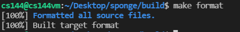
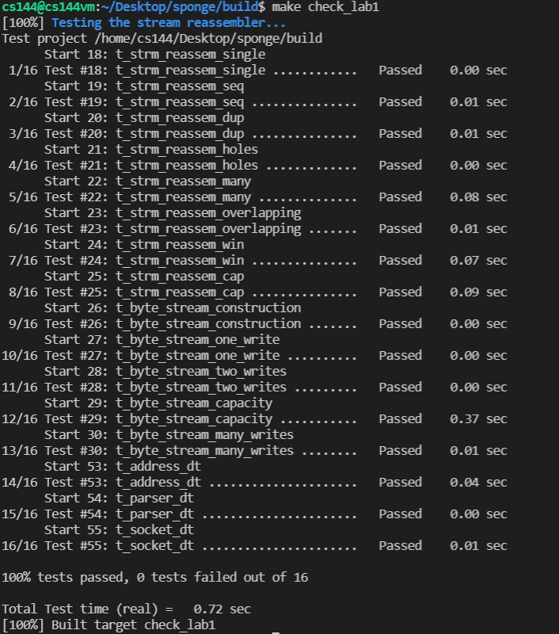

# Lab 1: stitching substrings into a byte stream

## 1.Putting substrings in sequence(moderate)

In Lab 1, we’ll implement a stream reassembler—a module that stitches small pieces of the byte stream (known as substrings, or segments) back into a contiguous stream of bytes in the correct sequence.

In this lab, I use a programming idea, OOT, whose full name is test-oriented programming... And I strongly don't recommend you to do this...

### 1.1 FAQs(important)

- When should bytes be written to the stream? As soon as possible. The only situation in which a byte should not be in the stream is that when there is a byte before it that has not been “pushed” yet.
- May substrings overlap? Yes. 
- What’s the “capacity”? You can understand it as the sum of the index of the next string needed by StreamReassembler and the remaining capacity of _output

### 1.2 add private members

```cpp
    // substring actually
    struct Segment {
        uint64_t index = 0;
        uint64_t end = 0;
        std::string data = "";
        bool operator<(const Segment segment) const { return index < segment.index; }
    };
    // unassembled bytes
    size_t _unassembled = 0;
    bool _eof = false;
    // the index of next segment
    size_t _head = 0;
    std::set<Segment> _segments = {};
    ByteStream _output;  //!< The reassembled in-order byte stream
    size_t _capacity;    //!< The maximum number of bytes
    // merge segments
    struct Segment merge(Segment data_left, Segment data_right);
    // init segment
    struct Segment init(const std::string &data, const size_t index);
```

I think it is simple to understand, so I won’t explain too much here.

### 1.3 init

```cpp
StreamReassembler::Segment StreamReassembler::init(const string &data, const size_t index) {
    Segment pre_segment;
    // empty string
    pre_segment.end = data.size() == 0 ? 0 : index + data.size() - 1;
    // This situation is ok!
    if(index >= _head){
        pre_segment.index = index;
        pre_segment.data = data;
    }
    // The end of the segment must be greater than _head.
    else{
        pre_segment.index = _head;
        // useless data
        if(pre_segment.end < _head)
            return pre_segment;
        pre_segment.data = data.substr(_head - index);
    }
    return pre_segment;
}
```

This function accepts one string and its index. In this function, the string will be initialized. For example, data may be "". Or _head is 8, but index is 0 and data is "abc".

We have to process these special cases.

- Empty string. It is useless, so I set its end value to 0.
- If the index value of data is less than _head, we need to tailor it.

### 1.4 merge

```cpp
//! \details This function accepts two substrings (aka two segments) of bytes,
//! and merge them.
StreamReassembler::Segment StreamReassembler::merge(Segment data_left, Segment data_right) {
    // data_left.index need to be less than data_right.index
    if (data_left.index > data_right.index)
        return merge(data_right, data_left);
    // data_left.end >= data_right.end means data_left contains data_right
    // the result of merging is data_left
    if (data_left.end >= data_right.end){
        _unassembled -= data_right.data.size();
        return data_left;
    }
    else {
        Segment merge_data;
        // sub-string
        uint64_t start = data_left.end - data_right.index + 1;
        merge_data.data = data_left.data + data_right.data.substr(start);
        merge_data.index = data_left.index;
        merge_data.end = data_right.end;
        _unassembled -= data_left.data.size() + data_right.data.size() - merge_data.data.size();
        return merge_data;
    }
}
```

If data_left.index > data_right.index, we call this function again. This will greatly facilitate the implementation of this function.

So if data_left.index <= data_right.index and data_left.end >= data_right.end, it means data_left contains data_right. The result of merging is data_left. Note that both data_left and data_right are unassembled segments, so _unassembled = _unassembled + len(merge_data) - len(data_left) - len(data_right).

If data_left doesn't contain data_right, it's a little complicated, but not hard. we need to tailor data_right and stitch the two together.

### 1.5 push_substring

I will explain this function into several parts.

```cpp
void StreamReassembler::push_substring(const string &data, const size_t index, const bool eof) {
    // capacity over
    if (index >= _head + _output.remaining_capacity()) 
        return;
```

Check whether the capacity is exceeded.

```cpp
    string pre_data;
    if (index + data.size() > _head + _output.remaining_capacity())	{
        pre_data = data.substr(0, _head + _output.remaining_capacity() - index);
	} else {
		_eof = _eof ? _eof : eof;
        pre_data = data;
	}
	Segment merge_data = init(pre_data, index);
```

If index + data.size() > _head + _output.remaining_capacity(), it means the data cannot be completely filled in the StreamReassembler and needs to be cropped.

```cpp
    // if merge_data.end < merge_data.index, there must be something wrong
    if(merge_data.end >= merge_data.index){
        // unassembled bytes update
        _unassembled += merge_data.data.size();
        int count = 1;
        std::set<Segment>::iterator it;
        while (count) {
            count--;
            it = _segments.begin();
            for (; it != _segments.end(); it++) {
                // if merge_data intersects with *it
                if ((merge_data.index <= it->end && merge_data.end >= it->index) || (it->index <= merge_data.end && it->end >= merge_data.index) || it->index - merge_data.end == 1 || merge_data.index - it->end == 1) {
                    merge_data = merge(*it, merge_data);
                    _segments.erase(it);
                    count++;
                    break;
                }
            }
        }
        _segments.insert(merge_data);
        // write to _output
        it = _segments.begin();
        if(it->index == _head){
            _output.write(it->data);
            _unassembled -= it->data.size();
            _head = it->end + 1;
            _segments.erase(it);
        }
    }
```

In this part, we iteratively process merge_data. If it can be spliced with other segments, we stitch the two together. Then perform the same iterative processing on the spliced new segment(merge_data). Until the end of the loop, we take out the first element in the set to try whether it can be put in _output.

```cpp
    // end input
    if (_eof && empty()) {
        _output.end_input();
    }
}
```

Terminate input.

The complete code is:

```cpp
void StreamReassembler::push_substring(const string &data, const size_t index, const bool eof) {
    // capacity over
    if (index >= _head + _output.remaining_capacity()) 
        return;
    // data preprocessing
    string pre_data;
    if (index + data.size() > _head + _output.remaining_capacity())	{
        pre_data = data.substr(0, _head + _output.remaining_capacity() - index);
	} else {
		_eof = _eof ? _eof : eof;
        pre_data = data;
	}
    Segment merge_data = init(pre_data, index);

    // if merge_data.end < merge_data.index, there must be something wrong
    if(merge_data.end >= merge_data.index){
        // unassembled bytes update
        _unassembled += merge_data.data.size();
        int count = 1;
        std::set<Segment>::iterator it;
        while (count) {
            count--;
            it = _segments.begin();
            for (; it != _segments.end(); it++) {
                // if merge_data intersects with *it
                if ((merge_data.index <= it->end && merge_data.end >= it->index) || (it->index <= merge_data.end && it->end >= merge_data.index) || it->index - merge_data.end == 1 || merge_data.index - it->end == 1) {
                    merge_data = merge(*it, merge_data);
                    _segments.erase(it);
                    count++;
                    break;
                }
            }
        }
        _segments.insert(merge_data);
        // write to _output
        it = _segments.begin();
        if(it->index == _head){
            _output.write(it->data);
            _unassembled -= it->data.size();
            _head = it->end + 1;
            _segments.erase(it);
        }
    }
    // end input
    if (_eof && empty()) {
        _output.end_input();
    }
}
```

### 1.6 unassembled_bytes

```cpp
size_t StreamReassembler::unassembled_bytes() const { return _unassembled; }
```

### 1.7 empty

```cpp
bool StreamReassembler::empty() const { return _unassembled == 0; }
```

## 2.run screenshot





