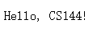
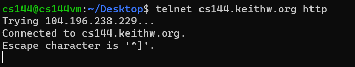
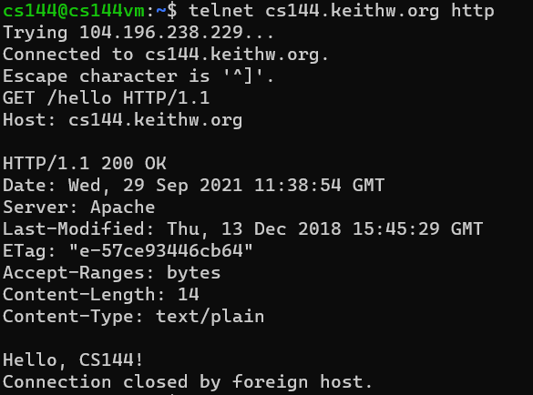
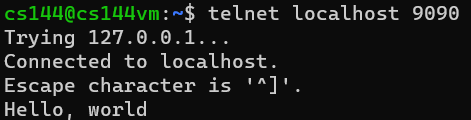
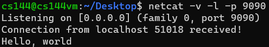
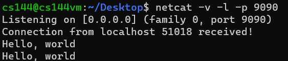
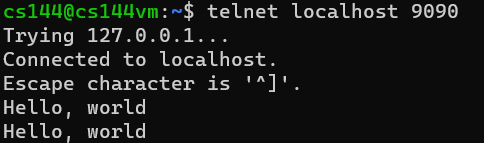
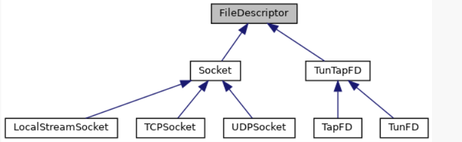
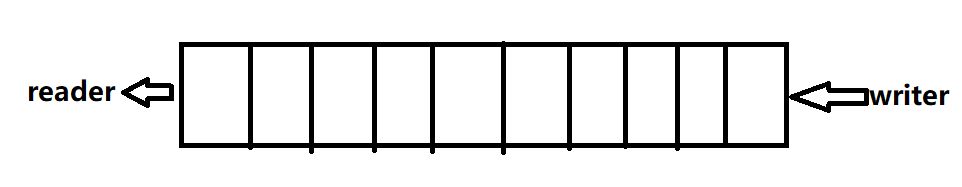
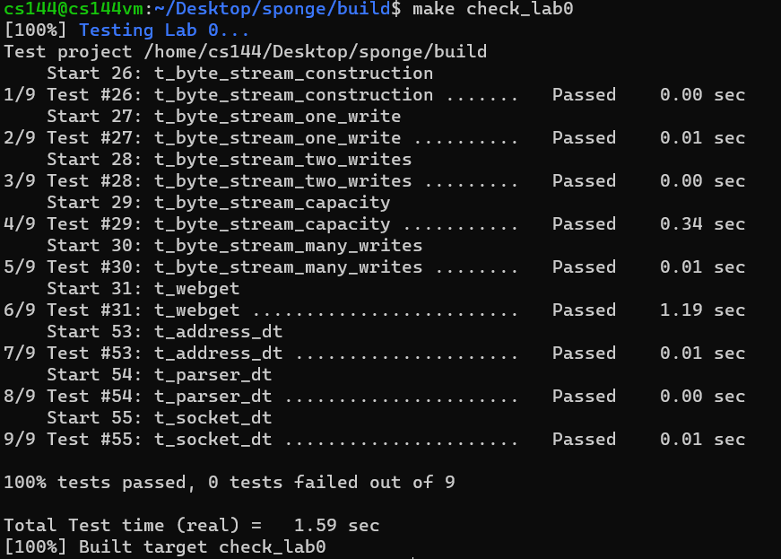

# lab 0: networking warmup

## 1.Set up GNU/Linux on your computer

Just follow the tutorial...

## 2.Networking by hand（easy）

### 2.1 Fetch a Web page

1. In a Web browser, visit http://cs144.keithw.org/hello, and you will see like this:



2. Now, on your VM.

(a) Run `telnet cs144.keithw.org http`, you will see:



(b) Type `GET /hello HTTP/1.1`

(c) Type `Host: cs144.keithw.org`

(d) Type enter



3. Assignment

I have  no SUNet ID...

### 2.2 Send yourself an email

I have no SUNet ID...

### 2.3 Listening and connecting

(a) Type "Hello, world" in the telnet window, and you will see "Hello world" in the netcat window.

client:



server:



(b) Type "Hello, world" in the netcat window, and you will see "Hello world" in the telnet window.

server:



client:



## 3. Writing a network program using an OS stream socket（easy）

To do this part well, you must recall what we have done in Sec. 2.1. So in Sec. 2.1, we run `telnet cs144.keithw.org http`, type `GET /hello HTTP/1.1`, type `Host: cs144.keithw.org`. Note that we type an enter again. After doing these, we get a "Hello, CS144!"!

In this part, what we need to do is translate these into C++ codes. You need to carefully read the documents of FileDescriptor, Socket, Tcpsocket and Address classes before you can understand the meaning of the following code:

```cpp
    // in get_URL your codes may be like this
	TCPSocket socket;
    socket.connect(Address(host, "http"));
    // Send http request to the server
    socket.write("GET " + path + " HTTP/1.1\r\nHost: " + host + "\r\n\r\n");
    // shutdown
    socket.shutdown(SHUT_WR);
    // Print out everything the server sends back
    while (!socket.eof()) 
        cout << socket.read();
    socket.close();
```

(a) telnet $\rightarrow$ connect()

Telnet means we should establish contact with a host. So the question is which host? The answer is in the function's parameters. Note that it is an http request.

(b) GET, Host $\rightarrow$ write(), read()

If you have read sponge documentation, you should be familiar with these functions. You may find that write() and read() are not member functions of the Socket class, but we can still call them, why?



This is the reason, they are subclasses of FileDescriptor. Strongly recommend you to read this [example](https://cs144.github.io/doc/lab0/class_t_c_p_socket.html) to understand how to use read() and write(). Note that in HTTP, each line must be ended with “\r\n” (it’s not sufficient to use just “\n” or endl). You have to call read repeatedly until the socket reaches “EOF” (end of file).

Remember to call the **shutdown** method of a TCPSocket!

## 4. An in-memory reliable byte stream（easy）

In this part, you need to implement an in-memory reliable byte stream. If you have learned about OS, you must be familiar with it, it is just a very simple pipe.



So from this image, you may understand what is a byte stream. A cache that stores data, the writer writes data from one end, and the reader reads data from the other end. To implement the cache, you need to choose a data structure,  **list**, **deque**, **queue**, even **vector**, all will be ok.

```cpp
private:
    // Your code here -- add private members as necessary.

    // Hint: This doesn't need to be a sophisticated data structure at
    // all, but if any of your tests are taking longer than a second,
    // that's a sign that you probably want to keep exploring
    // different approaches.

    // buffer
    std::deque<char> _buffer = {};
    // the capacity of data
    size_t _capacity;
    // the signal of input end
    bool _input_end = false;
    // read total
    size_t _read_total = 0;
    size_t _write_total = 0;
    // at first the stream does not suffer an error
    bool _error = false;  //!< Flag indicating that the stream suffered an error.
```

```cpp
ByteStream::ByteStream(const size_t capacity) : _capacity(capacity) {}

size_t ByteStream::write(const string &data) {
    size_t length = _capacity - _buffer.size();
    length = length < data.size() ? length : data.size();
    for (size_t i = 0; i < length; i++) {
        _buffer.push_back(data[i]);
    }
    _write_total += length;
    return length;
}

//! \param[in] len bytes will be copied from the output side of the buffer
string ByteStream::peek_output(const size_t len) const {
    size_t length = len < _buffer.size() ? len : _buffer.size();
    return string().assign(_buffer.begin(), _buffer.begin() + length);
}

//! \param[in] len bytes will be removed from the output side of the buffer
void ByteStream::pop_output(const size_t len) {
    size_t length = len < _buffer.size() ? len : _buffer.size();
    _read_total += length;
    while (length--) {
        _buffer.pop_front();
    }
    return;
}

//! Read (i.e., copy and then pop) the next "len" bytes of the stream
//! \param[in] len bytes will be popped and returned
//! \returns a string
std::string ByteStream::read(const size_t len) {
    std::string read_buffer = peek_output(len);
    pop_output(len);
    return read_buffer;
}

void ByteStream::end_input() { _input_end = true; }

bool ByteStream::input_ended() const { return _input_end; }

size_t ByteStream::buffer_size() const { return _buffer.size(); }

bool ByteStream::buffer_empty() const { return _buffer.empty(); }

bool ByteStream::eof() const { return buffer_empty() && input_ended(); }

size_t ByteStream::bytes_written() const { return _write_total; }

size_t ByteStream::bytes_read() const { return _read_total; }

size_t ByteStream::remaining_capacity() const { return _capacity - _buffer.size(); }

```

## 5. run screenshot




