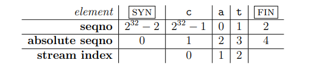
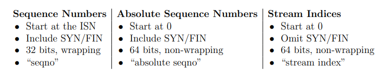
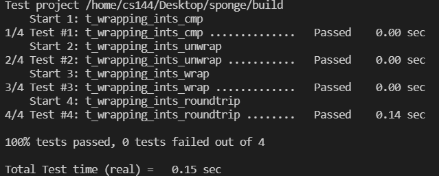
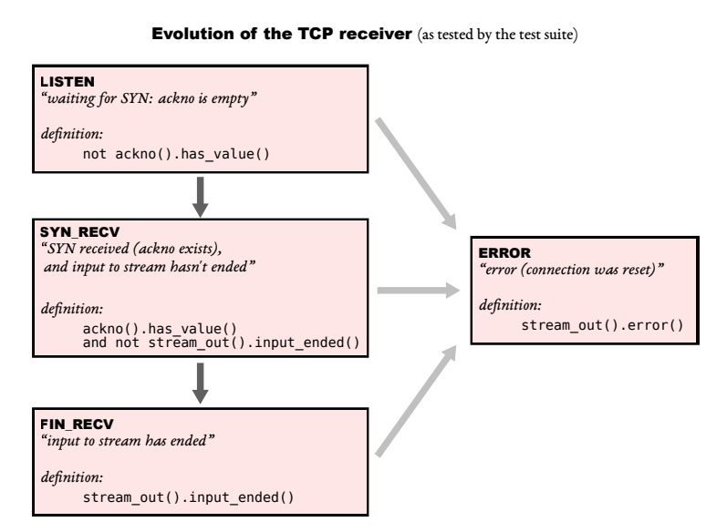
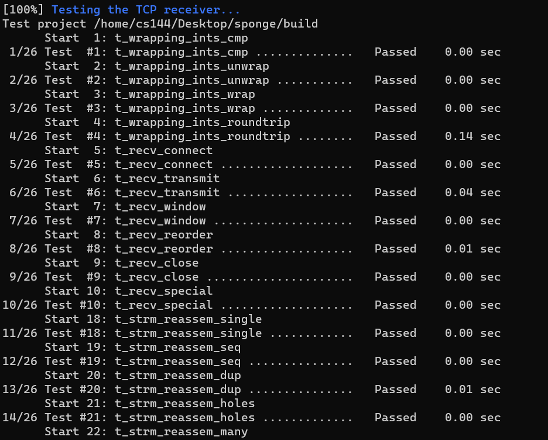
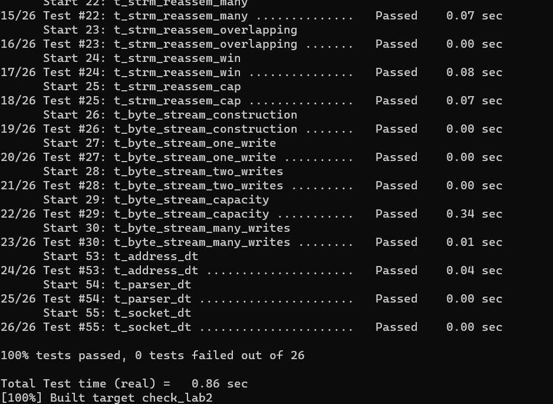

# Lab 2:  The TCP Receiver

## 1.Translating between 64-bit indexes and 32-bit seqnos

Last week we created a StreamReassembler that reassembles substrings where each individual byte has a 64-bit stream index.

In the TCP headers, however, space is precious, and each byte’s index in the stream is represented not with a 64-bit index but with a 32-bit “sequence number,” or “seqno.”

What we need to do is to translate betwwen 64-bit indexes and 32-bit seqnos.

### 1.1 analysis

#### 1.1.1 Sequence Numbers & Absolute Sequence Numbers & Stream Indices



This figure shows the relationship between them:

- offset = (seqno + ISN) % ISN ( absolute seqno is based on the checkpoint)
- stream index = absolute seqno - 1(There is something wrong, we talk about it later)
- seqno = (absolute seqno + ISN) % $2^{32}$



#### 1.1.2 checkpoint

It is clear in the document. With an ISN of zero, the seqno “17” corresponds to the absolute seqno of 17, but also $2^{32}+17$, or $2^{33}+17$, or $2^{34}+17$, etc. Therefore, we need a checkpoint ,which is the index of the last reassembled byte to help resolve the ambiguity.

### 1.2 coding

#### 1.2.1 wrap

Note that both isn.raw_value() and n is unsigned. There is no need to take the modulus.

```cpp
WrappingInt32 wrap(uint64_t n, WrappingInt32 isn) { 
    return isn + static_cast<uint32_t>(n); 
}

```

#### 1.2.2 unwrap

**offset = (seqno + ISN) % ISN**

Note that n.raw_value() and isn.raw_value() are unsigned, so (n.raw_value() - isn.raw_value()) == (n.raw_value() + isn.raw_value()) % isn.raw_value().

As to checkpoint, it is equal to A * $2^{32}$ + B, what we need to do is to choose the best answer from  A * $2^{32}$ + B,  (A+1) * $2^{32}$ + B, (A-1)  * $2^{32}$ + B. If A == 0, (A-1)  * $2^{32}$ + B is no need to caculate.

```cpp
uint64_t unwrap(WrappingInt32 n, WrappingInt32 isn, uint64_t checkpoint) {
    const uint64_t pow2_32 = 1ul << 32;
    uint32_t offset = n.raw_value() - isn.raw_value();
    // checkpoint = top32(from 32 bit to 63) + down32(from 0 to 31)
    uint64_t top32 = checkpoint & 0xFFFFFFFF00000000;
    uint64_t num1 = (top32 - pow2_32) + offset;
    uint64_t num2 = top32 + offset;
    uint64_t num3 = (top32 + pow2_32) + offset;
    uint64_t diff1 = checkpoint - num1;
    uint64_t diff2 = num2 > checkpoint ? num2 - checkpoint : checkpoint - num2;
    uint64_t diff3 = num3 - checkpoint;
    if (!top32)
        return diff2 < diff3 ? num2 : num3;
    if (diff1 < diff2)
        return diff1 < diff3 ? num1 : num3;
    else
        return diff2 < diff3 ? num2 : num3;
}
```

### 1.3 run screenshot



## 2. Implementing the TCP receiver



### 2.1 private member

```cpp
    // ISN
    WrappingInt32 _isn{WrappingInt32(0)};
    // SYN & FIN flag
    bool _syn{false};
    bool _fin{false};
```

### 2.2 window size()

The window_size() indicates how much data can be accommodated in tcp receiver, thus telling the sender the range of data to be sent next. Through lab0 and lab1, we know that byte_stream and stream_reassembler actually share a buffer, so the remaining space can directly call the remaining_capacity() function in byte_stream.

```cpp
size_t TCPReceiver::window_size() const { 
    return _reassembler.stream_out().remaining_capacity(); 
}
```

### 2.3 ackno()

- What ackno() returns is the first byte the receiver is interested in receiving.
-  If the ISN hasn’t been set yet, return an empty optional.
- The total number of bytes written by ByteStream is equal to absolute seqno.

```cpp
optional<WrappingInt32> TCPReceiver::ackno() const {
    if (!_syn)
        return nullopt;
    uint64_t abs_seqno = stream_out().bytes_written();
    if (_fin && stream_out().input_ended())
        abs_seqno++;
    return optional<WrappingInt32>(wrap(abs_seqno + 1, _isn));
}

```

### 2.4 segment received()

***Note that the SYN flag is just one flag in the header. The same segment could also carry data and could even have the FIN flag set.***

It means any segment may carry data. 

***stream index = absolute seqno - 1(There is something wrong, we talk about it later)***

Remember it? If any segment may carry data, it means that stream index is equal to absolute seqno, because the segment could also carry data and could even have the SYN and FIN flag set.

It is completely different from 2019.

```cpp
void TCPReceiver::segment_received(const TCPSegment &seg) {
    TCPHeader header = seg.header();

    if (!header.syn && !_syn)
        return;

    if (header.syn && !_syn) {
        _syn = true;
        _isn = header.seqno;
    }
    if (header.fin)
        _fin = true;

    uint64_t checkpoint = stream_out().bytes_written();
    uint64_t abs_seqno = unwrap(header.seqno, _isn, checkpoint);
    string data = seg.payload().copy();
    _reassembler.push_substring(data, abs_seqno, _fin);
}
```

### 2.5 run screenshot





